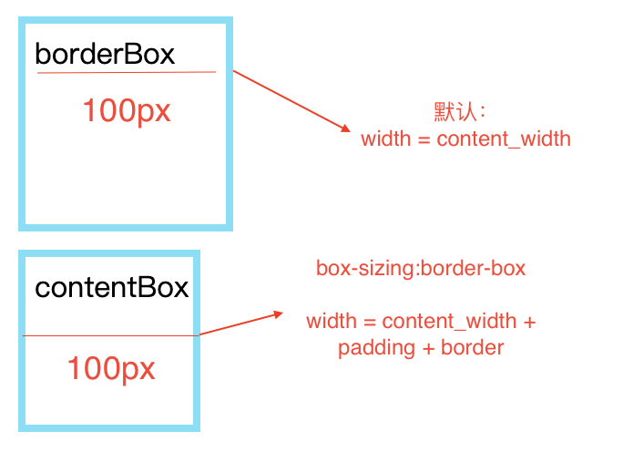

# 盒子模型
CSS中组成一个块级盒子需要：
- `Content box`：用来显示内容
- `Padding box`：内容区域外部的空白区域
- `Border box`：包裹内容和内边距
- `Margin box`：最外面的区域

## 标准盒模型
如果给盒设置`width` 和`height`，实际上设置的是`content box`。`padding` 和`border` 再加上设置的宽高一起决定整个盒子的大小。  
  
## 替代盒模型
内容宽度是该宽度减去边框和填充部分。  
  
**默认浏览器会使用标准模型**，可以通过
```css
选择器 {
  box-sizing: border-box;
}
```
来使用替代盒子模型

