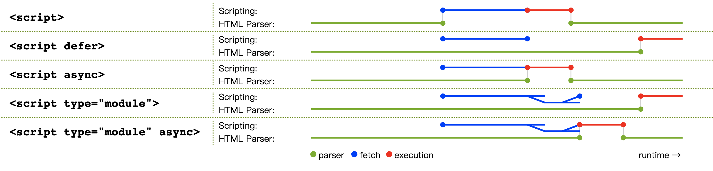

# 深入理解浏览器
浏览器一共分为四个部分。
## 架构
浏览器的实现架构：  
1. **一个进程包含多个线程**
2. 每**新开一个标签页，就会创建一个新的渲染器进程**。不仅如此，Chrome 还会尽量给每个站点新开一个渲染器进程，包括iframe中的站点，以实现**站点隔离**。
  
下面详细了解一下每个进程的作用，可以参考一下：
- 浏览器进程：负责**协调承担各项工作的其他进程**，如：实用程序进程、浏览器进程、GPU进程、插件进程等。
- 渲染器进程：负责在标签页中显示网络及处理事件。
- 插件进程：控制网站用到的所有插件
- GPU进程：在独立的进程中处理GPU任务。
  
多进程架构的优点：
1. **3个标签页就是3个渲染器进程**。如果有一个渲染器崩溃了，只要把它关掉即可，**不会影响其他标签页**。如果所有标签页都运行在一个进程中，那只要有一个标签页卡住，所有标签页都会卡住。
2. 多进程架构还有助于**安全和隔离**。因为操作系统有限制进程特权的机制，浏览器可以借此限制某些进程的能力。比如，Chrome会限制处理任意用户输入的渲染器进程，不让它任意访问文件。
3. Chrome会**限制自己可以打开的进程数量**。限制的条件取决于设备内存和CPU配置。达到限制条件后，Chrome会用一个进程处理同一个站点的多个标签页。
4. 在低配设备中，多个服务合并为一个进程，节约资源。

**站点隔离**：是新引入的一个特性，即**每个跨站点iframe都运行一个独特的渲染器进程**。即使像前面说的，每个标签页单开一个浏览器进程，但**允许跨站点的iframe 运行在同一个渲染器进程中并共享内存空间**，那安全攻击仍然有可能绕开同源策略。  
  
**进程隔离**是隔离站点、确保上网安全最有效的方式。不同的iframe运行在不同进程中，开发工具在后台仍然要做到无缝切换，而且即便简单地**Ctrl+F查找也会涉及在不同进程中搜索**。  
## 导航
从**输入URL到获取HTML响应**的过程，叫做**导航**。  
  
**标签页外面的一切都是由浏览器进程处理**。**浏览器进程中有线程（UI线程）负责绘制浏览器的按钮和地址栏，有线程（网络线程）负责处理网络请求并从互联网接受数据，有线程（存储线程）负责访问文件和存储数据。**  
  
**导航的几个步骤**：
1. 处理输入：UI线程会**判断用户输入的是查询字符串还是URL**
2. 开始导航：如果是URL，**UI线程会通知网络线程发起网络调用**，获取网站内容。网络线程进行DMS查询，建立TLS连接（对于HTTPS）。网络线程可能收到服务器的重定向头部，如HTTP 301，此时网络线程会跟UI线程沟通，告诉他服务器需要重定向。然后，再发起一个另一个URL的请求。
3. 读取响应：**网络线程检查服务器返回的响应体的前几个字节**。响应的`Context-Type` 头部应该包含数据类型，如果没有这个字段，则需要MIME类型嗅探。**如果响应是HTML文件，那下一步就是把数据交给渲染器进程。**但如果是一个zip文件或其他文件，那就意味着是一个下载请求，需要把数据传给下载管理器。
4. **联系渲染器进程**。所有查检完毕，网络线程确认浏览器可以导航到用户请求的网站，于是会**通知UI线程数据已经准备好了。UI线程会联系渲染器进程渲染页面。**
5. **提交导航**。数据和渲染器进程都有了，就可以通过IPC从浏览器进程向渲染器进程提交导航。渲染器进程也会同时接收到不间断的HTML数据流。当浏览器进程收到渲染器进程的确认消息后，导航完成，文档加载阶段开始。
6. **初始加载完成**。提交导航之后，渲染器进程将负责加载资源和渲染页面。在完成渲染后，渲染器进程会通过IPC给浏览器进程发送一个消息。此时，UI线程停止标签页上的旋转图标。
  
## 渲染
**浏览器解析HTML、下载外部资源、计算样式并把网页绘制到屏幕上**
  
**解析HTML**：
- **构建DOM**
- **加载子资源**
- **JS可能阻塞解析**：如果HTML解析器碰到`<script>` 标签，会暂停解析HTML文档并加载、解析和执行JavaScript代码。因为JavaScript有可能通过`document.write()`修改文档，进而改变DOM结构
  - 为了更好地加载资源，可以通过很多方式告诉浏览器。如果JavaScript没有用到`document.write()`，可以在`<script>` 标签上添加`async` 或`defer` 属性。这样浏览器就会**异步运行JavaScript代码，不会阻塞解析。**
- **计算样式**：**主线程要解析CSS并计算每个DOM节点的样式**
- **布局**：找到元素间的几何位置关系。主线程会遍历DOM元素及其计算样式，然后构造一棵布局树，**这棵树的每个节点将带有坐标和大小信息**。**布局树与DOM树的结构类似，但只包含页面中可见元素的信息**。通过伪类`p::before{content: 'Hi!'}` 添加的内容会包含在布局树中，但DOM树中却没有。
- **绘制**：解决先画什么后画什么，即绘制顺序的问题。比如，`z-index` 影响元素叠放，如果有这个属性，那简单地按元素在HTML中出现的顺序绘制就会出错。
  - 如果元素有动画，浏览器就需要每帧运行一次渲染流水线。目前显示器的刷新率为每秒60次（60fps），也就是说每秒更新60帧，动画会显得很流畅。如果中间缺了帧，那页面看起来就会闪眼睛。
  - 即便渲染操作的频率能跟上屏幕刷新率，但由于计算发生在主线程上，而主线程可能因为运行JavaScript被阻塞。此时动画会因为阻塞被卡住。
  - 可以使用`requestAnimationFrame()` 将涉及动画的JavaScript操作**分块并调度到每一帧的开始去运行**。对于耗时的不必操作DOM的JavaScript操作，可以考虑`Web Worker`，避免阻塞主线程
- **合成**：把文档结构、每个元素的样式、页面的几何关系，以及绘制顺序转换为屏幕上的像素叫做**栅格化**。
  - 最简单的方式，可能就是把页面在当前视口中的部分先转换为像素。然后随着用户滚动页面，再移动栅格化的画框（frame），填补缺失的部分。Chrome最早的版本就是这样干的。
  - 但现代浏览器会使用一个更高级的步骤叫合成。合成（composite）是**将页面不同部分先分层并分别栅格化，然后再通过独立的合成器线程合成页面**。这样当用户滚动页面时，因为层都已经栅格化，所以浏览器唯一要做的就是合成一个新的帧。而动画也可以用同样的方式实现：先移动层，再合成帧。
  - **为了确定哪个元素应该在哪一层，主线程会遍历布局树并创建分层树**
  - 创建了分层树，确定了绘制顺序，主线程就会把这些信息提交给合成器线程。合成器线程接下来负责将每一层转换为像素——栅格化。一层有可能跟页面一样大，此时合成器线程会将它切成小片（tile），再把每一片发给栅格化线程。栅格化线程将每一小片转换为像素后将它们保存在GPU的内存中。

**资源加载优先级**如下：  
  
## 交互
交互意味着来自用户的任何输入：鼠标滚轮转动、触摸屏幕、鼠标悬停，这些都是交互。