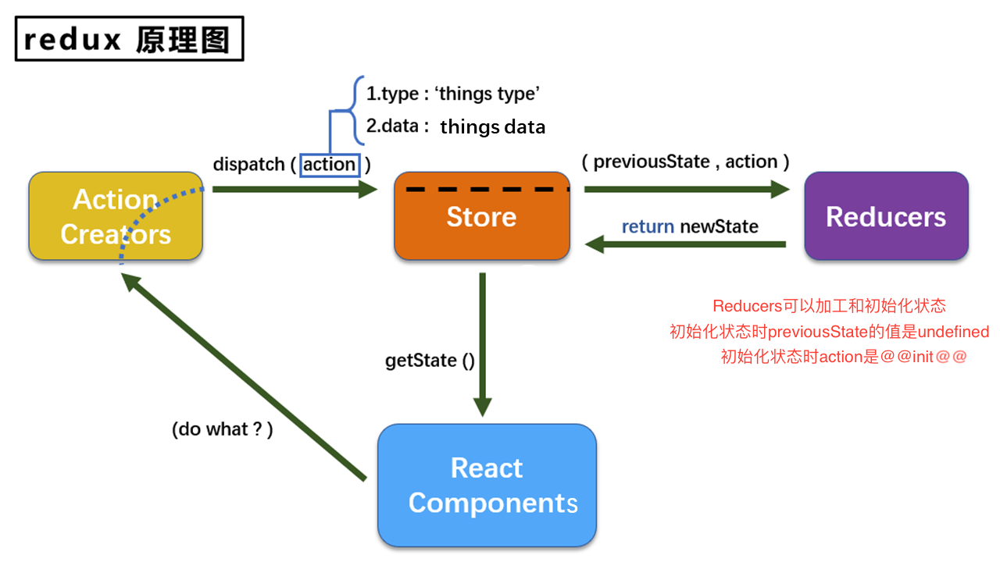

# Redux 的基本使用

### Action

**Action** 对象是一个具有`type` 字段的普通 JavaScript 对象。

type 字段是一个字符串，给这个 action 一个描述性的名字，比如`"todos/todoAdded"`。

字符串通常写成`"域/事件名称"`的形式，第一部分是这个 action 所属的特征或类别，第二部分是发生的具体事情。

Action 对象可以有其他字段，其中包含有关发生的事情的附加信息。按照惯例，我们将该信息放在名为`payload` 的字段中。

```js
const addTodoAction = {
  type: "todos/todoAdded",
  payload: "Buy milk",
};
```

### Reducer

**Reducer 是一个函数，接收当前的 state、和一个 action 对象。**

函数签名是：`(state, action) => newState`

**Reducer 可以视为一个事件监听器，它根据接收到的 action（事件）类型处理事件。**

Reducer 必须遵循以下规则：

- **禁止修改`state`**，必须通过在现有的`state` 上进行复制，并对复制的值进行更改来做**不可变更新**
- 禁止任何异步逻辑、依赖随机值或导致其他"副作用"的代码
- 仅使用 `state` 和 `action` 参数计算新的状态值

### Store

当前 Redux 应用的状态存在于一个名为 **store** 的对象中。

**store 是通过传入一个 reducer 来创建的**，并且有一个名为 `getState` 的方法，它返回当前状态值：

```js
import { configureStore } from "@reduxjs/toolkit";

const store = configureStore({ reducer: counterReducer });

console.log(store.getState());
// {value: 0}
```

### Dispatch

Redux store 有一个方法叫 `dispatch`。**更新 state 的唯一方法是调用 `store.dispatch()` 并传入一个 action 对象**。

```js
store.dispatch({ type: "counter/increment" });

console.log(store.getState());
// {value: 1}
```

**store 将执行所有 reducer 函数**并计算出更新后的 state，调用 `getState()` 可以获取新 state。

我们通常调用 `action creator` 来调用 action：

```js
const increment = () => {
  return {
    type: "counter/increment",
  };
};

store.dispatch(increment());

console.log(store.getState());
// {value: 2}
```

### Selector

**Selector 函数可以从 store 状态树中提取指定的片段**。随着应用变得越来越大，会遇到应用程序的不同部分需要读取相同的数据，selector 可以避免重复这样的读取逻辑：

```js
const selectCounterValue = (state) => state.value;

const currentValue = selectCounterValue(store.getState());

console.log(currentValue);
// 2
```

### Redux 的工作步骤

初始启动：

- 使用最顶层的 **root reducer 函数创建 Redux store**
- store 调用一次 root reducer，并将返回值保存为它的初始 `state`
- 当 UI 首次渲染时，UI 组件访问 Redux store 的当前 state，并使用该数据来决定要呈现的内容。**同时监听 store 的更新，以便他们可以知道`state` 是否已更改。**

更新环节：

- 应用程序中发生了某些事情，例如用户单击按钮
- dispatch 一个 action 到 Redux store，例如 `dispatch({type: 'counter/increment'})`
- store 用之前的 `state` 和当前的 `action` 再次运行 reducer 函数，并将返回值保存为新的 `state`
- store 通知所有订阅过的 UI，通知它们 store 发生更新
- 每个订阅过 store 数据的 UI 组件都会检查它们需要的 state 部分是否被更新。
- 发现数据被更新的每个组件都强制使用新数据重新渲染，紧接着更新网页

### Redux App

在线预览[Redux App](https://stackblitz.com/edit/react-rbp3wv?file=src%2FApp.js)

<!-- # Redux
Redux的使用场景：
- 1、某个组件的状态需要让其他组件随时拿到
- 2、一个组件需要改变另一个组件的状态

## Redux的原理

## 使用Redux
- 1、安装Redux
```shell
yarn add redux
# or
npm install redux
```
- 2、新建文件夹 `src/redux`
- 3、在`redux` 文件夹📂 下新建`xxx_action` 文件 `xxx_action.js`
:::details
@[code](./xxx_action.js)
:::
> 这一步可以省略，通过在组件中给<code>store</code> 创建并发送<code>action</code> 对象, 关于<code>redux-thunk</code> 的基本使用可见 [✈️](./Redux的基本使用.html#redux-thunk-的基本使用)
- 4、在`redux` 文件夹📂 下新建`store` 文件 `store.js`
:::details 点击查看<code>sotre.js</code> 的详细信息
@[code](./store.js)
:::
- 5、在`redux` 文件夹📂 下新建`reducer` 文件`xxx_reducer.js`
:::details 点击查看<code>xxx_reducer.js</code> 的详细信息
@[code js{7-9,20}](./xxx_reducer.js)
:::
- 6、在组件中引入<code>store.js</code>
:::details 点击展开
@[code](./组件使用store.js)
:::
- 7、**存在问题**：组件状态发生改变，但是页面不会重新更新，需要再次调用 `render()`
:::details 点击查看解决方案
@[code](./修改状态后页面不更新解决方案.js)
:::
- 8、可以增加一个常量文件<code>constant.js</code>
:::details 点击查看<code>constant.js</code> 的详细信息
@[code](./constant.js)
:::
## <code>redux-thunk</code> 的基本使用
- 1、安装
```shell
npm install redux-thunk
# or
yarn add redux-thunk
```
- 2、在<code>store.js</code> 中引入<code>redux-thunk</code>
@[code](./redux-thunk的基本使用.js) -->
